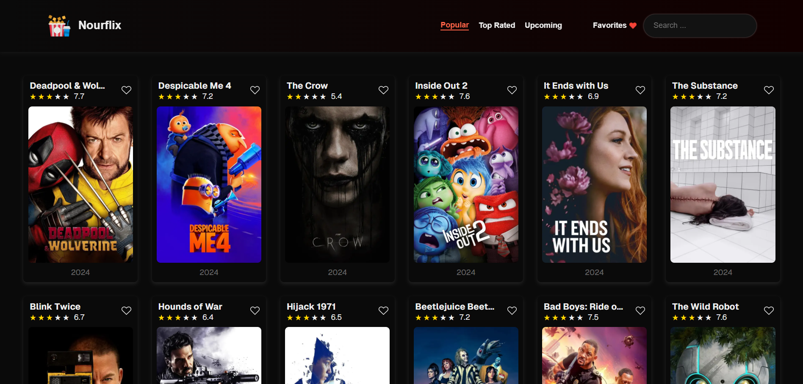
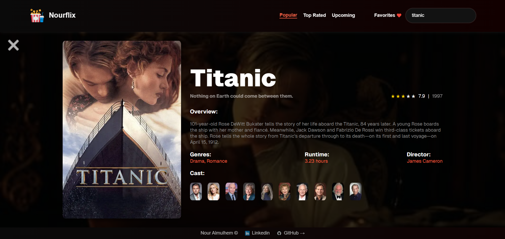
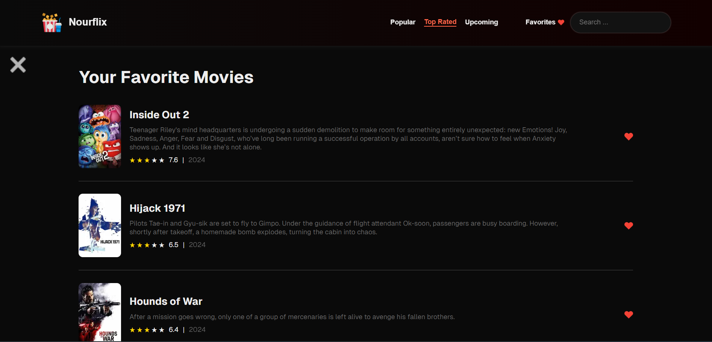

<div align= >

#  Nourflix

</div>
<div align="center">
   

### ”You'll definitely want to see this. 👀“

</div>

<p align="center">
    <br>
</p>

##  Table of Contents

- <a href ="#about"> 📙 Overview</a>
- <a href ="#started"> 💻 Get Started</a>
- <a href ="#features"> 🔍 Features</a>
- <a href ="#architecture"> 👀 Architecture</a>
- <a href ="#contributors"> ✨ Contributors</a>
- <a href ="#license"> 🔒 License</a>

<hr style="background-color: #4b4c60"></hr>

##  Overview <a id = "about"></a>

<ul>

<li>
Welcome to Nourflix, the ultimate movie discovery platform! Nourflix provides comprehensive information about all your favorite films. Explore detailed movie descriptions, cast and crew details, and ratings to help you make informed choices on what to watch next. With Nourflix, you can create and personalize your own favorite movie list, making it easy to keep track of the films you love and those you plan to watch in the future. Whether you're a casual viewer or a dedicated cinephile, Nourflix is your go-to source for all things movies!
</li>
<br>
<li>The project is built by
<ol>

<li>
<a href="https://nextjs.org/">Next.js</a>
</li>
<li>
<a href="https://eslint.org/">eslint</a>
</li>
<li>
<a href="https://www.axios.com/">axios</a>
</li>
</ol>
</li>

<br>
<li>
You can view
<a href="https://nouralmulhem.github.io/Nourflix/">Nourflix</a>,
you might find the platform not deployed yet, until the GitHub repository is public
</li>
</ul>
<hr style="background-color: #4b4c60"></hr>

##  Get Started <a id = "started"></a>

<ol>
<li>Clone the repository

<br>

```
git clone https://github.com/nouralmulhem/Nourflix.git
```

</li>
<li>Install packages

<br>

```
bun install
```

</li>
<li>Run the development server:

<br>

```bash
bun run dev
```

Open [http://localhost:3000](http://localhost:3000) with your browser to see the result.

</li>
</ol>
<hr style="background-color: #4b4c60"></hr>

##  Features <a id ="features"></a>

<hr style="background-color: #4b4c60"></hr>

<table align="left;">
<tr>
<th width=20%>Feature</th>
<th width=50%>ScreenShot</th>
<th>Description</th>
</tr>

<tr>
<td>
🔶 Home Page
</td>
<td>

   
</td>
<td>
<ul>
<li>Search</li>
<li>Filter by Genre</li>
<li>Pagination</li>
<li>Animation</li>
</ul>
</td>
</tr>

<tr>
<td>
🔷 Movie Page
</td>
<td>

   
</td>
<td>
<ul>
<li>Movie Details</li>
<li>Cast</li>
</ul>
</td>
</tr>

<tr>
<td>
🔶 Favorites Page
</td>
<td>

   
</td>
<td>
<ul>
<li>Favorite Movies</li>
<li>Remove from list</li>
<li>Animated removal</li>
</ul>
</td>
</tr>
</table>
</br>

<hr style="background-color: #4b4c60"></hr>

##  Architecture <a id = "architecture"></a>

### Project Architecture

```plaintext
|-- app/
|   |-- layout.tsx/
|   |-- page.tsx/
|   |-- favorite/
|       |-- page.tsx
|   |-- movie/
|       |-- [id]/
|           |-- page.tsx
|-- components/
|   |-- Dashboard/
|       |-- Dashboard.tsx
|       |-- dashboard.module.css
|   |-- Favorite/
|       |-- Favorite.tsx
|       |-- favorite.module.css
|-- design-system/
|   |-- CloseIcon/
|       |-- CloseIcon.tsx
|       |-- close-icon.module.css
|   |-- Spinner/
|       |-- Spinner.tsx
|       |-- spinner.module.css
|-- widgets/
|   |-- Notification/
|       |-- Notification.tsx
|       |-- notification.module.css
|-- hooks/
|   |-- useFetch.ts
|-- services/
|   |-- getMovieById.ts
|   |-- getMovies.ts
|-- store/
|   |-- notification.ts
|   |-- genre.ts
|-- utils/
|   |-- convertToHours.ts
|-- next.config.js
|-- tsconfig.json
```

<br>

- I structured the architecture by organizing pages, client components, design system (reusable) components, and stand-alone widget components into separate modules.

- I also separated all hooks, service interaction utilities, and logic into distinct directories.

- This approach enables more efficient and focused consideration of SSR and CSR components while simplifying both state management and UI rendering.

### Bonus Points

- Implementing server-side rendering for key high-level components.

- Providing user notifications and ensuring smooth interactions.

- Ensuring a fully responsive design, compatible with both desktop and mobile devices.

- Adding animated actions, such as smoothly removing a movie from the favorites list.

<br>

<hr style="background-color: #4b4c60"></hr>

##  Contributors <a id ="contributors"></a>

<table  >
  <tr>
     <td align="center"><a href="https://github.com/nouralmulhem"><br /><sub><b>Nour Ziad Almulhem</b></sub></a><br /></td>
  </tr>
</table>

## 🔒 License <a id ="license"></a>

> **Note**: This software is licensed under MIT License, See [License](https://github.com/nouralmulhem/Nourflix/blob/main/LICENSE) for more information ©Nourflix.
